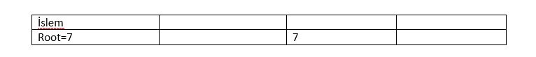
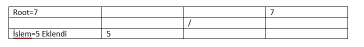
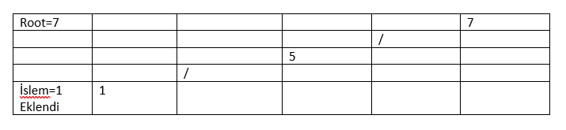
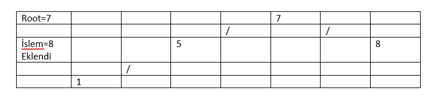
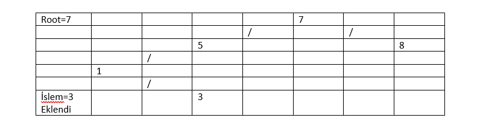
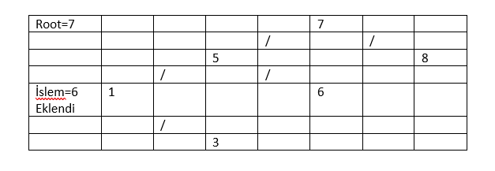
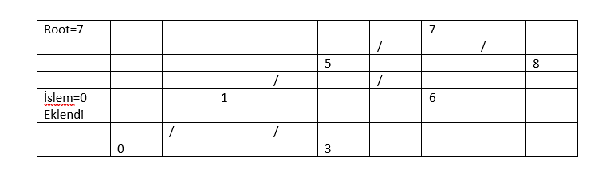
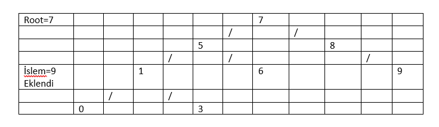
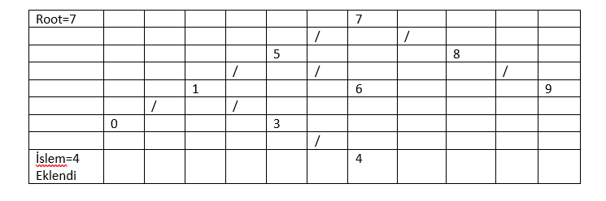
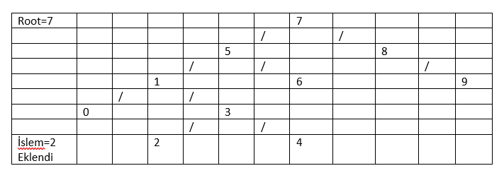

# Binary Search Tree Projesi

[7, 5, 1, 8, 3, 6, 0, 9, 4, 2] dizisinin Binary-Search-Tree aşamalarını yazınız.

1.İlk eleman 7 olduğu için, root olarak 7'yi düşündük.
 
2. 5 elemanı root'un solunda bulunur.
 
3. 1 elemanı root'un solunda bulunur. Aynı zamanda 5 sayısından küçük olduğu için onun da solunda bulunur.
 
4. 8 elemanı root'un sağında bulunur.
 
5. 3 elemanı root'un solunda bulunur. Aynı zamanda 5 sayısından küçük olduğu ve 1 sayısından büyük olduğu için 1 sayısının sağında bulunur.
 
6. 6 elemanı root'un solunda bulunur. Aynı zamanda 5 sayısından büyük olduğu için onun sağında bulunur.
 
7. 0 elemanı root'un solunda bulunur. Aynı zamanda 1 sayısından küçük olduğu için tree'de en solda bulunur.
 
8. 9 elemanı root'un sağında bulunur. Aynı zamanda 8 sayısından da büyük olduğu için onun da sağında bulunur.
 
9. 4 elemanı root'un solunda bulunur. Aynı zamanda 5 sayısından küçük olduğu onun solunda ve 3 sayısından büyük olduğu için 3 sayısının sağında bulunur.
 
10. 2 elemanı root'un solunda bulunur. Aynı zamanda 1 sayısından büyük olduğu için onun sağında ve 3 sayısından küçük olduğu için 3 sayısının solunda bulunur.
 
