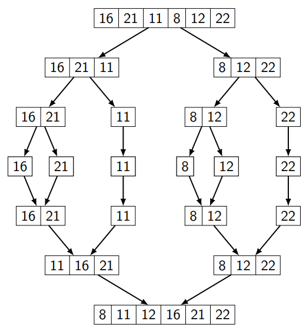

# [16,21,11,8,12,22] -> Merge Sort

Yukarıdaki dizinin sort türüne göre aşamalarını yazınız.
Big-O gösterimini yazınız.

1. 
2. Big-O gösterimi : Dizinin n tane sayı içerdiği düşünülürse O(n.log(n)) şeklinde ifade edilir.

<a href="https://app.patika.dev/slckerdogan">Profil Linkim ektedir